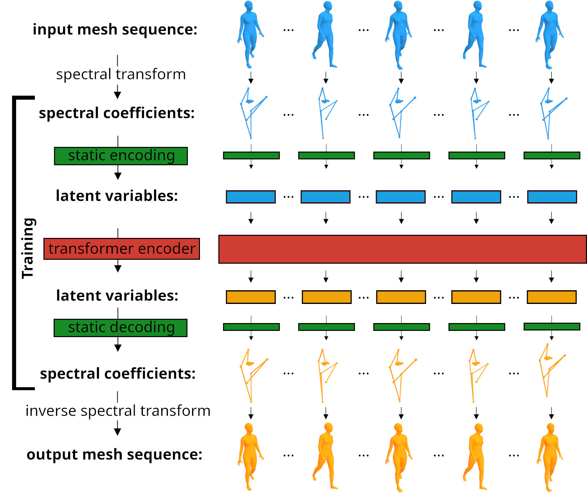

# SpecTrHuMS: Spectral Transformer for Human Mesh Sequence learning

This repository contains the PyTorch implementation of the paper **SpecTrHuMS: Spectral Transformer for Human Mesh Sequence learning** by *Clément Lemeunier, Florence Denis, Guillaume Lavoué and Florent Dupont*.

<p align="center">

</p>

## Setup

The code was tested on Linux with PyTorch 2.0.1, CUDA 11.7 and Python 3.10.

Create a conda environment and activate it:
```
conda create -n SpecTrHuMS python=3.10
conda activate SpecTrHuMS
```

Install [PyTorch](https://pytorch.org/get-started/locally/).

Install [Human Body Prior](https://github.com/nghorbani/human_body_prior): clone the repository, and execute commands in the `Installation` chapter while the conda environment is activated (launch both commands even if there are errors).

Install requirements:
```
pip install -r requirements.txt
```

## SMPL connectivity and its eigenvectors + pretrained model

Download [this archive](https://drive.google.com/file/d/1blzKhIiMS630qI8t1YaaNYdWZhYt1Rmb/view?usp=sharing) and extract it to the root folder. It contains the SMPL connectivity with its eigenvectors computed with [Matlab](https://fr.mathworks.com/products/matlab.html) and a pretrained model corresponding to the SpecTrHuMS-MI (see paper). This should create two folders: `data` and `checkpoints`.

## SMPL models

Download [Extended SMPL+H model](https://psfiles.is.tuebingen.mpg.de/downloads/mano/smplh-tar-xz). Create a folder `smplh` in the `data` folder previously created, and extract the archive in the `smplh` folder. Then, download [DMPLS](https://download.is.tue.mpg.de/download.php?domain=smpl&sfile=dmpls.tar.xz), create a folder `dmpls` in the `data` folder, and extract the archive in the `dmpls` folder. This should give the following hierarchy:

```
data
 ┣ dmpls
 ┃ ┣ female
 ┃ ┃ ┗ model.npz
 ┃ ┣ male
 ┃ ┃ ┗ model.npz
 ┃ ┣ neutral
 ┃ ┃ ┗ model.npz
 ┣ smplh
 ┃ ┣ female
 ┃ ┃ ┗ model.npz
 ┃ ┣ male
 ┃ ┃ ┗ model.npz
 ┃ ┣ neutral
 ┃ ┃ ┗ model.npz
 ┣ evecs_4096.bin
 ┗ faces.bin
```

## Create the dataset

First, download the following [AMASS](https://amass.is.tue.mpg.de/download.php) datasets: 

1. CMU 
1. MPI_Limits 
1. TotalCapture 
1. Eyes_Japan_Dataset 
1. KIT 
1. EKUT 
1. TCD_handMocap 
1. ACCAD 
1. BioMotionLab_NTroje

Then, launch the following script: 

```python create_dataset.py```

This will create a dataset made of multiple identities. The size of the created dataset is approximately 20Gb. You can use less frequencies in order to have a smaller dataset by modifying the value in the file `dataset_creation/default_options_dataset.json`, but the dataset will not be usable by the given pretrained model and you will have to retrain a new one.

## Evaluate / visualize a pretrained model

A pretrained model is available in the `checkpoints/SpecTrHuMS-MI/` directory and corresponds to the *Spectral Transformer for Human Mesh Sequence learning using Multiple Identities*.

It is possible to: 
- evaluate the model's scores on the test dataset: `python test.py --load_job_id=SpecTrHuMS-MI`. After computation, scroll up a bit in the console to view results: this allows to reproduce results in Table 3 line `SpecTrHuMS-MI`. 
- visualize its ability to predict the end of animations: `python visualize.py --load_job_id=SpecTrHuMS-MI` using [aitviewer
](https://github.com/eth-ait/aitviewer). 

## Train a new model

In order to train a model, execute the following command by specifying a `job_id`: 
<br />
```python train.py --job_id=0 ``` <br />
or <br />
```python train.py --job_id=SpecTrHuMS-test``` 

Training is done using the framework [PyTorch Lightning](https://www.pytorchlightning.ai/index.html). It will create a new folder in the `checkpoints/` directory and create logs in the corresponding folder, which you can visualize using the command `tensorboard --logdir checkpoints/`. 

## Video

An additional video file is provided (in the `video` folder) in order to better visualise results.

<p align="center">
<video width="600" controls>
  <source src="video/SpecTrHuMS.mp4" type="video/mp4">
</video>
</p>

## Acknowledgements
This work was supported by the ANR project Human4D ANR-19-CE23-0020 and was granted access to the AI resources of IDRIS under the allocation 2023-AD011012424R2 made by GENCI.

## License
This work is Copyright of University of Lyon, 2022. It is distributed under the Mozilla Public License v. 2.0. (refer to the accompanying file LICENSE-MPL2.txt or a copy at http://mozilla.org/MPL/2.0/).